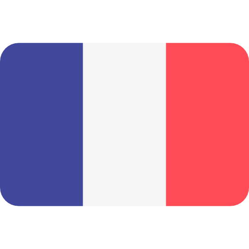

</img>

<table align="right">
 <tr><td><a href="README.md"> English</a></td></tr>
 <tr><td><a href="README_ar.md"> France</a></td></tr>
  <tr><td><a href="README_ar.md"> Brazil</a></td></tr>
</table>

<h1 align="center">Hi 👋, I'm Mohamed Ahmed</h1>

  <b>Software Engineer · Flutter Developer</b>

  Building practical software systems and turning ideas into real products.

---

### :space_invader: &nbsp;About Me

&nbsp;&nbsp;&nbsp; :technologist: &nbsp;Software Engineer focused on building practical and scalable software systems.
&nbsp;&nbsp;&nbsp; :computer: &nbsp;Currently working mainly with **Flutter, Dart, Java, SQLite, and Drift**.
&nbsp;&nbsp;&nbsp; :building_construction: &nbsp;Building **BPC — Business Platform Core**, a business management system designed around real-world business workflows.
&nbsp;&nbsp;&nbsp; :bulb: &nbsp;Interested in software architecture, clean code, automation, and solving real-world problems through technology.
&nbsp;&nbsp;&nbsp; :database: &nbsp;Interested in database design, offline-first applications, and reliable business data management.
&nbsp;&nbsp;&nbsp; :books: &nbsp;Always learning and improving my software engineering skills.

  &nbsp;&nbsp;&nbsp;&nbsp;
  &nbsp;&nbsp;&nbsp;&nbsp;

  
<b>:computer: &nbsp;Main tech knowledge</b>

   

#### :computer: Development

&nbsp;
&nbsp;
&nbsp;
&nbsp;
&nbsp;
&nbsp;
&nbsp;
&nbsp;
&nbsp;
&nbsp;
&nbsp;
&nbsp;
&nbsp;
&nbsp;
&nbsp;
&nbsp;

#### :building_construction: Architecture & Engineering

&nbsp;
&nbsp;
&nbsp;
&nbsp;
&nbsp;
&nbsp;
&nbsp;
&nbsp;

  
<b>:brain: &nbsp;Other knowledge, always learning</b>

   

&nbsp;
&nbsp;
&nbsp;
&nbsp;
&nbsp;
&nbsp;
&nbsp;
&nbsp;
&nbsp;
&nbsp;

### :rocket: &nbsp;Featured Project

#### BPC — Business Platform Core

A business management system designed to bring essential business operations into one connected system.

**Core areas include:**

- :shopping_bags: Products & Variants
- :package: Inventory Management
- :warehouse: Warehouses & Stock
- :bust_in_silhouette: Customer Management
- :receipt: Orders & Sales
- :arrows_counterclockwise: Returns & Exchanges
- :chart_with_upwards_trend: Business Analytics
- :moneybag: Expenses & Profit Tracking
- :office: Multi-Branch Business Support
- :iphone: Cross-platform Application
- :floppy_disk: Offline-first Data Architecture

**Technology:** Flutter · Dart · Drift · SQLite

---

### :brain: &nbsp;Currently Learning

- Advanced Flutter & Dart
- Software Architecture
- Database Design
- Offline-first Applications
- Business Software Architecture
- Application Testing
- Clean Code & Maintainable Systems
- AI-assisted Development
- Modern Development Workflows

---

  
<b>:gear: &nbsp;GitHub Statistics</b>

   

  

  
  

### :link: &nbsp;Connect With Me

  
  &nbsp;&nbsp;
  

---

  <i>Building software. Solving problems. Learning every day.</i>

  
  

